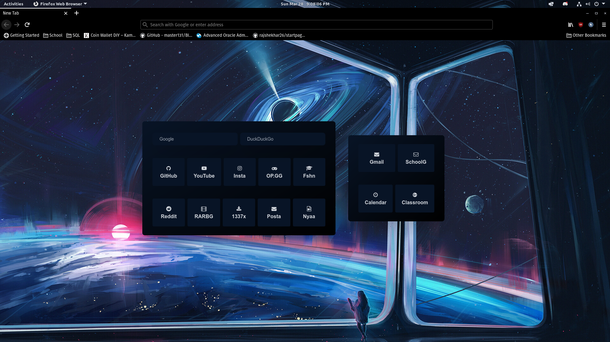

# Simple startpage for Firefox

## How to set up as home page and new tab
### For Linux
1. Clone this repository - git clone https://github.com/ropapermaker/startpage
1. Open firefox and go to Preferences > Home
1. In homepage and new windows add custom URL - file:///home/evo/Documents/ff-new-tab/public/index.html (change the location)
1. Go to newtab folder and open mozilla.cfg in an editor
1. Replace file location of index.html in newTabURL variable
1. Copy mozilla.cfg to /usr/lib/firefox/ `cp mozilla.cfg /usr/lib/firefox`
1. Copy local-settings.js to /usr/lib/firefox/defaults/pref `cp local-settings.js /usr/lib/firefox/defaults/pref`

### For Windows, slighly different from Linux
1. Clone this repository - git clone https://github.com/ropapermaker/startpage
1. Open firefox and go to Preferences > Home
1. In homepage and new windows add custom URL - file:///C:/Users/evo/Documents/ff-new-tab/public/index.html (change the location)
1. Go to newtab folder and open mozilla.cfg in an editor
1. Replace file location of index.html in newTabURL variable
1. Copy mozilla.cfg to C:\Program Files\Mozilla Firefox
1. Copy local-settings.js to C:\Program Files\Mozilla Firefox\defaults\pref
